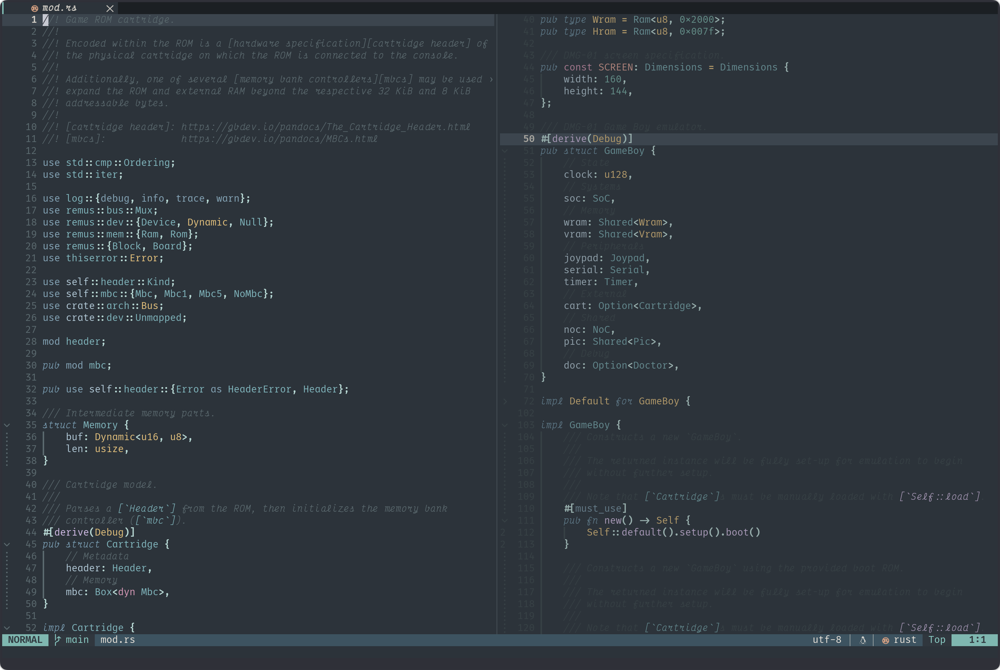

# deku.nvim

<p align="center">
  <q>
    Ah. So you have finally returned... You never fail to impress!
  </q>
  &mdash;
  <i>
    The Great Deku Tree
  </i>
</p>

<p align="center">
  
</p>

---

A pastel, fairy-like Neovim colorscheme 🌳

## Installation

You can install `deku.nvim` using any Neovim plugin manager. For example, using
`lazy.nvim`:

```lua
{
    "kaplanz/deku.nvim",
    dependencies = "rktjmp/lush.nvim",
}
```

## Usage

To change your colorscheme to `deku.nvim`, simply set the colorscheme with the
builtin command `:colorscheme`:

```vim
colorscheme deku
```

Or, using Lua:

```lua
vim.cmd.colorscheme("deku")
```

## Contributing

Contributions to `deku.nvim` are always welcome. Whether it's a bug report, new
feature, or improvement to existing features, your help is greatly appreciated!
